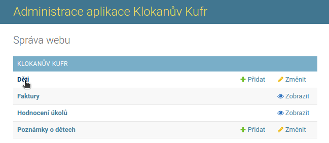
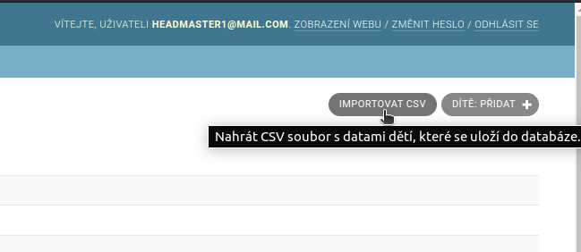
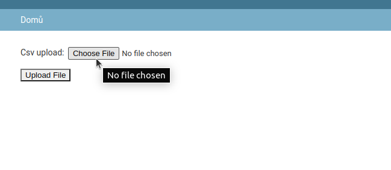
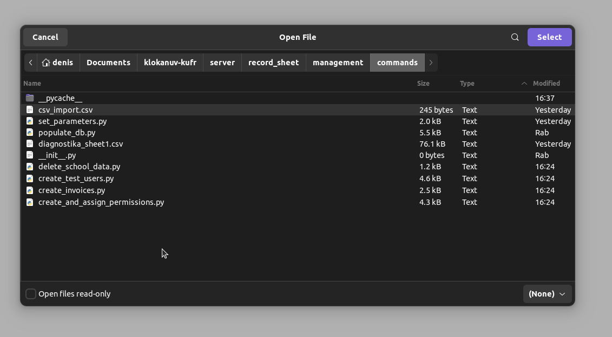
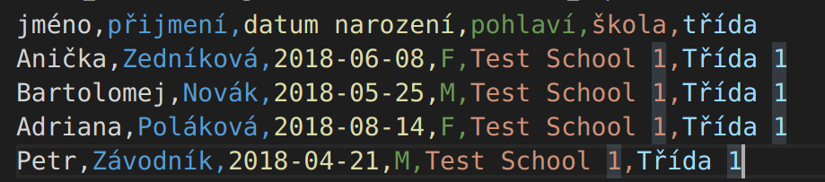
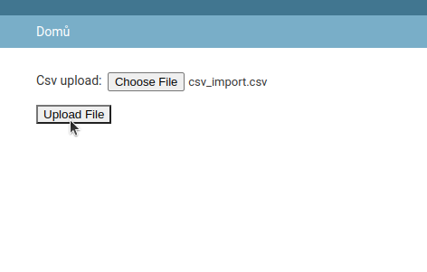
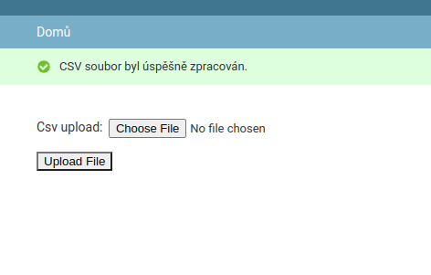

# Importování dětí použitím CSV
Toto je návod pro ředitele školky, jak hromadně importovat děti pomocí souboru ve formátu ***CSV***.

1. Z domovské stránky klikneme na položku ***Děti***.  

2. Poté klikneme na tlačítko ***Importovat CSV***, které se nachází vpravo nahoře.  

3. Otevře se nám nová stránka, kde najdeme pouze 2 tlačítka - ***Choose file*** a ***Upload File***. Nejdřív klikneme na ***Choose File***.  
  

4. Otevře se nám dialogové okno, kde vybereme náš CSV soubor. Pozor, soubor musí být ve formátu ***.csv*** (na samotném jménu nezáleží, na koncovce ***.csv*** ano).
Samotný soubor musí spĺnět následující podmínky:  
a) První řádek je vždy tento textový řetězec:
***jméno,přijmení,datum narození,pohlaví,škola,třída***  
, přičemž údaje v něm slouží jako názvy sloupců.  
b) Také si můžeme všimnout, že jsou odděleny oddělovači "," (čárka). Toto platí také při oddělování samotných hodnot, a musí být zachováno v celem CSV souboru. To, že tomu tak skutečně je, můžeme ověřit tak, že otevřeme CSV soubor v jednoduchém textovém editoru, kde uvidíme (případně můžeme hromadně změnit), zda je naším oddělovačem skutečne čárka. Také nesmíme zapomenout, že žádné z našich hodnot ani názvů sloupců nesmí obsahovat čárku.  
c) Jak vyplnit samotná data (což jsou 2. řádek a další) pro první dva sloupce v CSV je celkom zřejmé, vyplníme jméno a přijmení.  
d) U sloupečku ***datum narození*** si musíme dávat pozor na to, aby datum byl ve formátu ***YYYY-MM-DD***, tedy například ***2018-02-20***  
e) Do sloupečku ***pohlaví*** vkládáme pouze hodnoty ***M*** (male-muž) nebo ***F*** (female-žena)  
f) Do sloupečku ***škola*** vkládáme pouze název naší školky.  
g) Do sloupečku ***třída*** vkládáme název ***existující třídy***, do které dané dítě patří.  

  

5. Po potvzení výběru (dvojklik) jsme znovu na původním formuláři. Nyní stačí kliknou na tlačítko ***Upload File***
  

6. Nakonec by se nám měla ukázat hláška ***CSV soubor byl úspěšně zpracován***  
  
