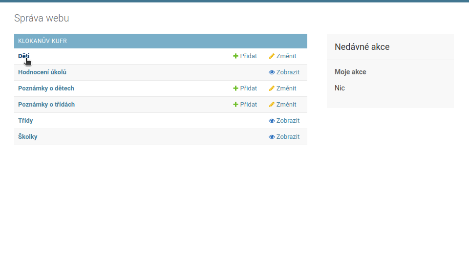
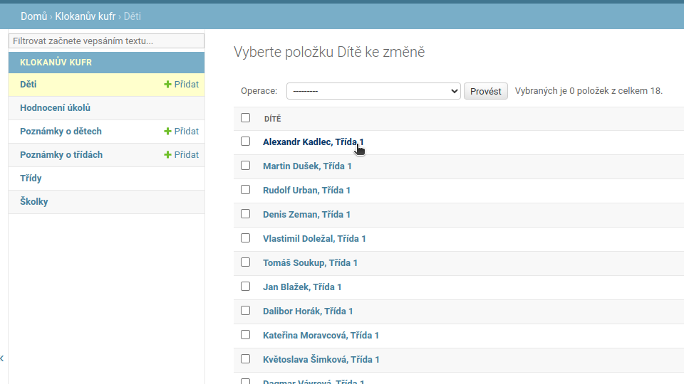
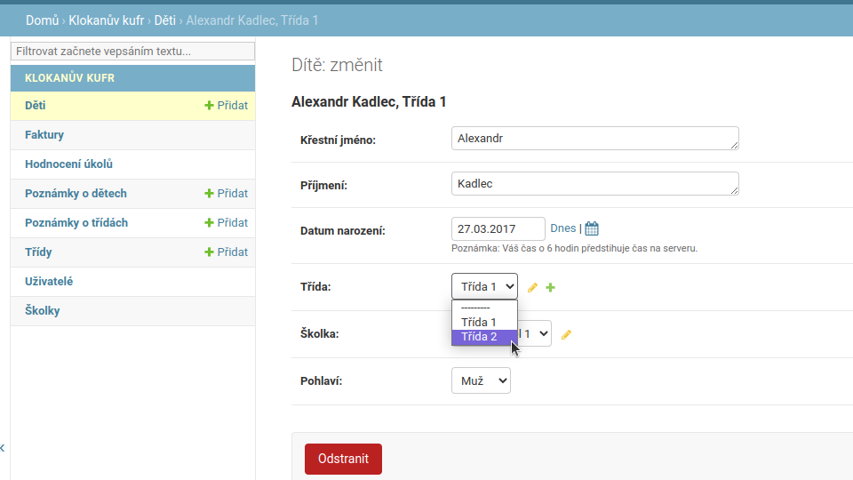
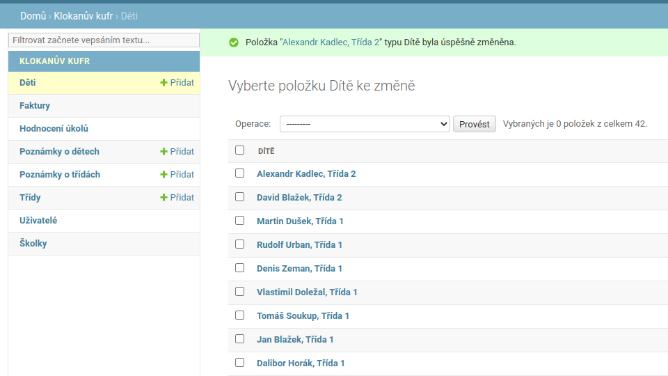

# Změnit dětem třídu
Toto je návod pro ředitele i učitele školky, jak přeřadit dítě do jiné třídy.  

1. Z domovské stránky klikneme na tlačítko ***Děti***.  
  

2. Ze seznamu dětí si vybereme to, které chceme přeřadit.  
  

3. Klikneme na selectbox ***Třída***, vybereme novou a klikneme na tlačítko ***Uložit***.  
  

4. Pokud vše proběhlo v pořádku, ukáže se nám hláška o úspěchu.  
  
