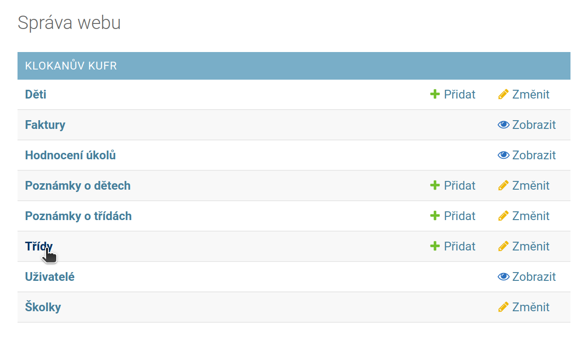
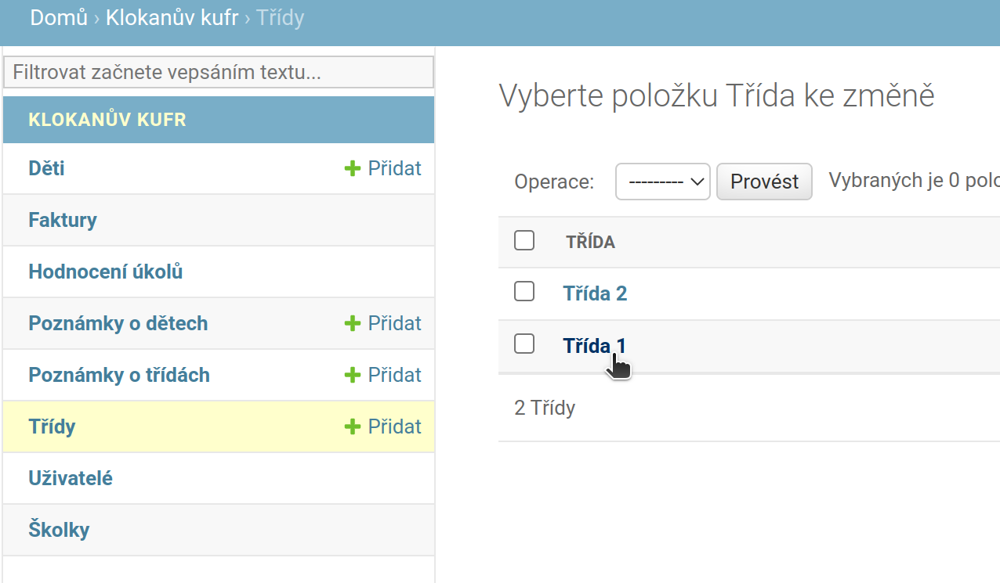
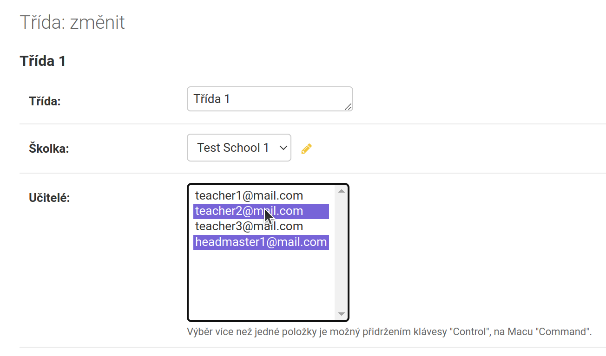

# Prohlížet a změnit třídu
Toto je návod pro ředitele a učitele školky, jak prohlížet třídy v jejich školce.  
Ředitel může také třídy editovat.

1. Z domovské stránky klikneme na tlačítko ***Třídy***.  

2. Otevře se nám list všech dostupných tříd. Můžeme kliknout na jednotlivou třídu a pokud jsme ředitel, můžeme také editovat ůdaje uvnitř.
  

# Následující body platí jen pro ředitele:  

1. Otevře se nám editovatelný formulář s údaje o tříde. Můžeme změnit název třídy. Školka ostává stejná a opět můžeme změnit, kteří učitelé mají ke třídě přístup. Vícero možností vybereme tak, že při klikání držíme klávesu CTRL.  
Po vyplnění klikneme na tlačítko "Uložit" (vpravo dole)

2. Po uložení se vypíše hláška o ůspešnem uložení třídy.

