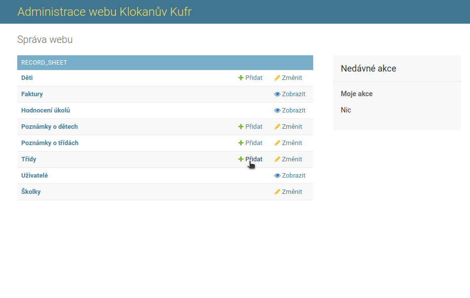
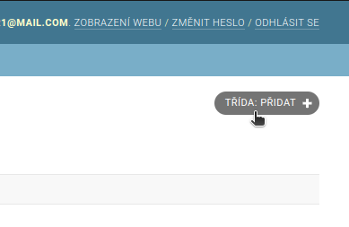
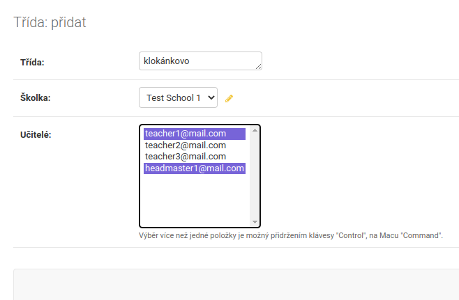
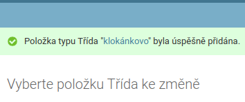

# Vytvoření třídy
Toto je návod pro ředitele školky, jak vytvořit třídu.

1. Z domovské stránky klikneme na tlačítko "Přidat" vedle položky Třídy. Alternativně můžeme nejdřív přejít do stránky "Děti", pak kliknout na tlačítko "TŘÍDA: PŘIDAT.

2. Otevře se nám formulář na údaje o nové tříde. Vypíšeme název třídy, vybereme školku a vybereme, kteří učitelé mají ke třídě přístup. Vícero možností vybereme tak, že při klikání držíme klávesu CTRL. Po vyplnění klikneme na tlačítko "Uložit" (vpravo dole)

3. Po uložení se vypíše hláška o ůspešnem uložení třídy.

